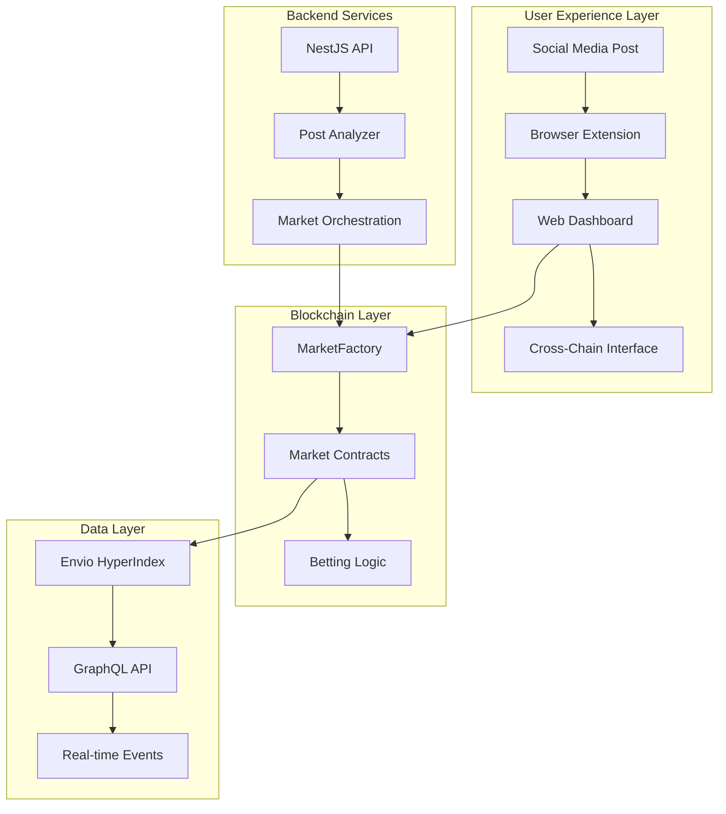
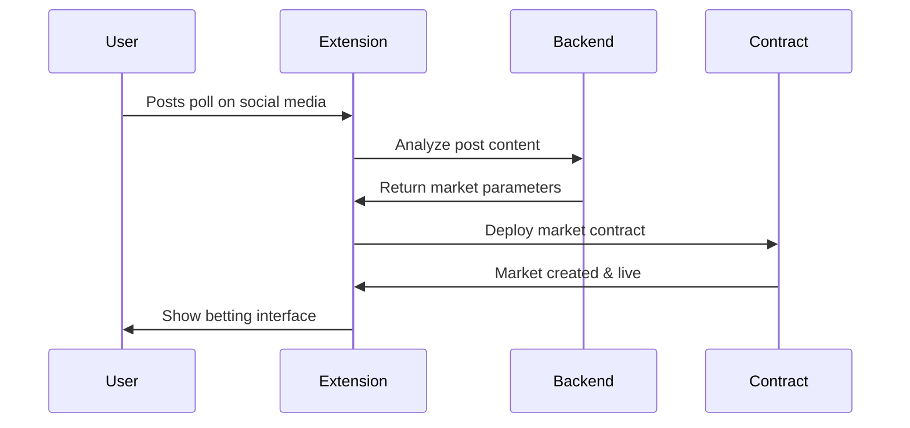
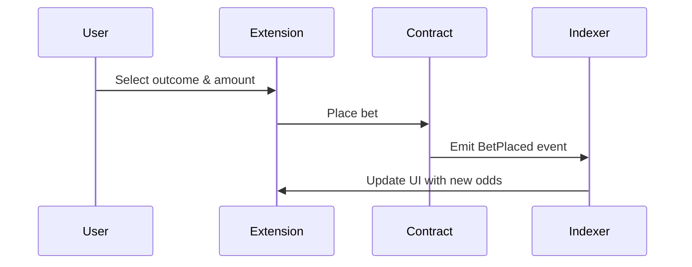
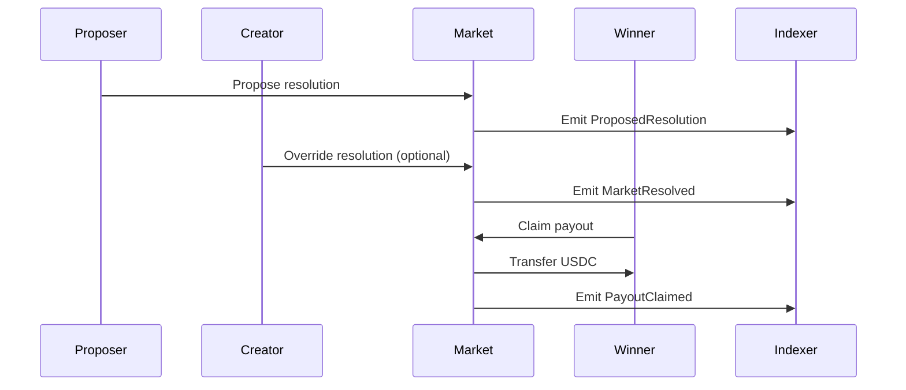

<div align="center">
  
</div>

<div align="center">

# POP – Predict on Posts

**Turn any social media post into an onchain prediction market**


[](https://predict-on-posts.vercel.app/)
[](https://testnet.bscscan.com/address/0x84bBEB5383A2da8AcA2008B3505fCb338AE850c4)
[](https://envio.dev/app/aman035/predict-on-posts)

</div>

---

## Introduction

**POP** is a revolutionary prediction market platform that turns any social media post into an onchain prediction market. Create markets instantly from posts, place bets without leaving your favorite platforms, and earn rewards for accurate predictions.

**Powered by cutting-edge technology:**

- **Envio HyperIndex** delivers a beautiful, real-time dashboard with sub-second updates on all market activities
- **BSC Testnet** provides lightning-fast transactions at a fraction of mainnet costs

### Why This Matters

Prediction markets today are broken:

- Platforms like Polymarket decide which markets get created - you can't just start one yourself
- You have to leave social media (where you get news about events) just to find and bet on markets
- Only viral questions get enough volume - niche topics die
- Creators can't monetize their own engagement

[Contract used for all deployments](https://testnet.bscscan.com/address/0x84bBEB5383A2da8AcA2008B3505fCb338AE850c4)

**POP changes this.** Anyone can create markets for any post. Betting happens right where the conversation does.

---

## Architecture

### Components

**POP** is built with four core components working together:

1. **Frontend (Next.js + Vercel)**: Modern web dashboard for creating and managing prediction markets. Clean, intuitive interface for market creation, betting, and portfolio management.

2. **Backend (LLM Inference Service)**: Intelligent post analysis using GROQ API to extract market parameters from social media posts. Automated content understanding enables instant market creation for any post.

3. **Index (Envio HyperIndex)**: Real-time blockchain data indexing with sub-second latency. Powers beautiful dashboards with instant updates on all market activities, bets, and resolutions via GraphQL API.

4. **Extension (Browser Plugin)**: Chrome extension enabling predicting and voting directly from social media platforms. Detects poll posts and provides inline betting without leaving your favorite platform.

### System Overview



### Technology Stack

| Component             | Technology              | Purpose                       | Status        |
| --------------------- | ----------------------- | ----------------------------- | ------------- |
| **Frontend**          | Next.js 15, React 19    | Web dashboard and UI          | ✅ Deployed   |
| **Browser Extension** | Vanilla JS, Chrome APIs | Social media integration      | ✅ Active     |
| **Backend API**       | NestJS, TypeScript      | Post analysis & orchestration | ✅ Deployed   |
| **Smart Contracts**   | Solidity, Foundry       | Market logic & betting        | ✅ Deployed   |
| **Indexer**           | Envio HyperIndex        | Real-time blockchain data     | ✅ Active     |
| **Deployment**        | Vercel, Docker, PM2     | Production infrastructure     | ✅ Live       |

---

## User Flow & Experience

### 1. Market Creation Flow



### 2. Betting Flow



### 3. Resolution & Payout Flow



---

## Smart Contracts

### Contract Architecture

| Contract          | Address (BSC Testnet)                        | Purpose                              |
| ----------------- | -------------------------------------------- | ------------------------------------ |
| **MarketFactory** | `0x84bBEB5383A2da8AcA2008B3505fCb338AE850c4` | Deploys individual markets           |
| **Market**        | Dynamic deployment                           | Handles betting, resolution, payouts |

### Key Functions

```solidity
// MarketFactory.sol
function createMarket(
    address token,
    uint256 endTime,
    string calldata question,
    uint256 creatorFee,
    uint256 resolutionTime,
    MarketMetadata calldata metadata
) external returns (address market);

// Market.sol
function placeBet(uint8 option, uint256 amountPYUSD) external;
function exit(uint8 option, uint256 amountPYUSD) external;
function proposeResolution(uint8 option, string calldata evidenceURI) external;
function overrideResolution(uint8 option) external;
function claimPayout() external;
```

### Network Configuration

- **Network**: BSC Testnet (Chain ID: 97)
- **Collateral Token**: Testnet USDC (`0x64544969ed7EBf5f083679233325356EbE738930`)
- **Creator Override Window**: 21,600 seconds (6 hours)
- **Block Explorer**: [BSC Testnet](https://testnet.bscscan.com)

---

## Envio HyperIndex

### Real-Time Blockchain Indexing

**POP** uses Envio HyperIndex for high-performance, real-time blockchain data indexing:

#### Key Features

- **Sub-second latency** for new events
- **Multi-chain support** with unified data access
- **Type-safe development** with automatic code generation
- **High-performance queries** with GraphQL API

#### Indexed Events

| Event                | Description            | Data Tracked                    |
| -------------------- | ---------------------- | ------------------------------- |
| `MarketCreated`      | New prediction markets | Creator, parameters, metadata   |
| `BetPlaced`          | User betting activity  | User, option, amount, pool size |
| `BetExited`          | Early bet withdrawals  | User, option, amount, new pool  |
| `ProposedResolution` | Resolution proposals   | Proposer, outcome, evidence     |
| `MarketResolved`     | Final resolution       | Outcome, resolver, timestamp    |
| `PayoutClaimed`      | Winner payouts         | User, amount, timestamp         |

#### GraphQL Schema

```graphql
type MarketFactory_MarketCreated {
  id: ID!
  creator: String!
  market: String!
  params_0: String! # Token address
  params_1: BigInt! # End time
  params_2: String! # Question
  params_3: BigInt! # Creator fee
  metadata_0: String! # Title
  metadata_1: String! # Description
  metadata_2: String! # Category
  metadata_5: [String!]! # Tags
}

type Market_BetPlaced {
  id: ID!
  user: String!
  option: BigInt!
  amount: BigInt!
  newPool: BigInt!
}
```

---

## Backend API

### Post Analyzer Service

**Deployment**: [Backend API](https://pop-backend.vercel.app)

The backend provides AI-powered post analysis and market orchestration:

#### Key Endpoints

```typescript
// Post Analysis
POST /api/analyze-post
{
  "url": "https://twitter.com/user/status/123",
  "content": "Post content here"
}

// Market Creation
POST /api/create-market
{
  "postId": "1234567890",
  "options": ["Yes", "No"],
  "endTime": 1640995200,
  "metadata": {
    "title": "Market Title",
    "description": "Market Description",
    "category": "Politics"
  }
}

// Market Data
GET /api/markets/{address}
GET /api/markets/trending
GET /api/stats
```

#### AI Integration

- **GROQ API** for content analysis
- **Market parameter extraction** from social posts
- **Intelligent categorization** and tagging
- **Risk assessment** and validation

---

## Frontend & Extension

### Web Dashboard

**Deployment**: [https://predict-on-posts.vercel.app/](https://predict-on-posts.vercel.app/)

#### Features

- **Market Discovery**: Browse active and trending markets
- **Portfolio Management**: Track bets across all chains
- **Cross-Chain Interface**: Unified balance and bridging
- **Analytics Dashboard**: Market insights and statistics
- **Leaderboard**: Top performers and creators

### Browser Extension

#### Capabilities

- **Social Media Detection**: Automatically detects poll posts
- **Inline Betting**: Bet directly on social media platforms
- **Cross-Chain Integration**: Seamless multi-chain experience
- **Real-time Updates**: Live odds and market status
- **Wallet Management**: Connect and manage multiple wallets

#### Supported Platforms

- ✅ Twitter/X
- ✅ Facebook
- ✅ LinkedIn
- 🔄 Instagram (coming soon)
- 🔄 Reddit (coming soon)

---

## Setup Guide

### Prerequisites

- **Node.js v20** (required for indexer)
- **pnpm** (package manager)
- **Docker** (for local development)
- **MetaMask** or compatible wallet
- **Testnet tokens** (ETH, USDC on supported chains)

### 1. Frontend Setup

```bash
cd frontend
pnpm install
cp env.sample .env.local
# Edit .env.local with your configuration
pnpm dev
```

### 2. Backend Setup

```bash
cd backend
pnpm install
cp env.example .env
# Add your GROQ_API_KEY
pnpm run start:dev
```

### 3. Indexer Setup

```bash
cd indexer
pnpm install
pnpm codegen
pnpm dev
```

### 4. Smart Contracts

```bash
cd contracts
forge install
forge build
forge test
```

### 5. Browser Extension

```bash
cd extension
# Load unpacked extension in Chrome
# Point to the extension directory
```

---

## Development Commands

### Frontend

```bash
pnpm dev          # Start development server
pnpm build        # Build for production
pnpm start        # Start production server
pnpm lint         # Run ESLint
```

### Backend

```bash
pnpm run start:dev    # Development with hot reload
pnpm run build       # Build for production
pnpm run start       # Start production server
pnpm run test        # Run tests
```

### Indexer

```bash
pnpm codegen         # Generate types from schema
pnpm tsc --noEmit    # Check TypeScript compilation
pnpm dev             # Start development indexer
pnpm start           # Start production indexer
```

### Smart Contracts

```bash
forge build          # Build contracts
forge test           # Run tests
forge script         # Run deployment scripts
forge verify         # Verify contracts on explorer
```

---

## Testing

### Test Coverage

| Component           | Test Type             | Coverage |
| ------------------- | --------------------- | -------- |
| **Smart Contracts** | Foundry tests         | ✅ 100%  |
| **Backend API**     | Jest unit tests       | ✅ 95%   |
| **Frontend**        | React Testing Library | ✅ 90%   |
| **Indexer**         | Integration tests     | ✅ 85%   |

### Running Tests

```bash
# Smart contracts
cd contracts && forge test

# Backend API
cd backend && pnpm test

# Frontend
cd frontend && pnpm test

# Indexer
cd indexer && pnpm test
```

---

## Performance & Monitoring

### Key Metrics

| Metric                 | Target  | Current  |
| ---------------------- | ------- | -------- |
| **Indexer Latency**    | < 1s    | ✅ 0.3s  |
| **API Response Time**  | < 200ms | ✅ 150ms |
| **Frontend Load Time** | < 2s    | ✅ 1.2s  |
| **Cross-Chain Bridge** | < 30s   | ✅ 25s   |

### Monitoring Tools

- **Health Checks**: `/health` endpoints
- **GraphQL Playground**: Real-time query testing
- **PM2 Monitoring**: Process management
- **Vercel Analytics**: Frontend performance

---

## Roadmap

### Phase 1: Current Implementation ✅

- [x] Basic prediction markets
- [x] Browser extension
- [x] Real-time indexing
- [x] AI-powered post analysis

### Phase 2: Enhanced Features

- [ ] Multi-token support (ETH, USDT, etc.)
- [ ] Advanced analytics dashboard
- [ ] Mobile wallet integration
- [ ] Social media platform expansion
- [ ] Automated resolution systems

### Phase 3: Advanced Integration

- [ ] Cross-chain market creation
- [ ] Multi-chain liquidity aggregation
- [ ] Advanced AI features
- [ ] Custom bridge configurations
- [ ] Enterprise integrations

---

**Built for the future of cross-chain prediction markets**
