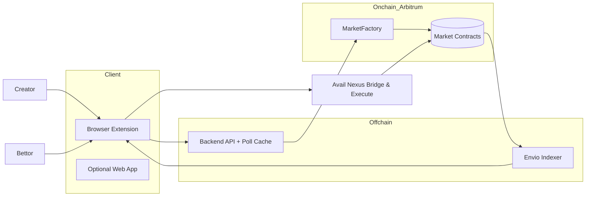
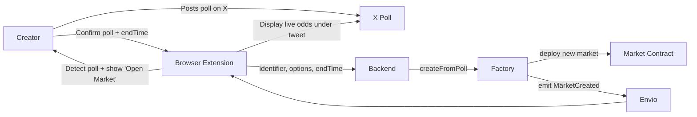
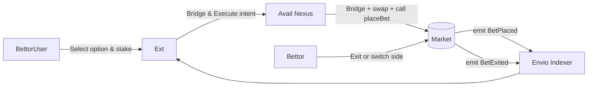
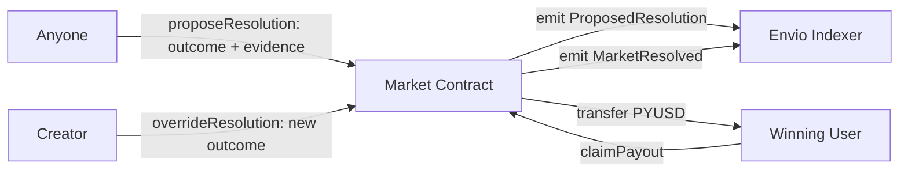

## 1. Concept

**POP – Predict on Posts** lets anyone turn a **Twitter/X poll** into an onchain prediction market.

When a creator posts a poll on X — for example:

> “Will I get Monad Aridrop ?”

our browser extension recognizes it and instantly spins up a market on **Arbitrum** using **PYUSD** as collateral.

Users can stake on poll options, exit or switch sides before the poll closes, and claim payouts after the poll result is finalized.

In short: **Polymarket, but embedded directly in Twitter.**

---

## 2. Why It’s Needed

| Pain Point                                                                              | How POP Solves It                                                                 |
| --------------------------------------------------------------------------------------- | --------------------------------------------------------------------------------- |
| Prediction markets are siloed off on external platforms like Polymarket, kalshi, myriad | Markets live _inside X itself_, accessible through a browser extension            |
| Onboarding friction (bridging, swapping, connecting wallets)                            | One-click “Bridge & Execute” via **Avail Nexus** handles everything automatically |
| Liquidity only for big, global questions                                                | Any creator can host micro-markets on their own polls                             |

---

## 3. Market Lifecycle Overview



---

## 4. Poll Creation → Market Creation

When a creator posts a **poll** on Twitter, they can enable “Betting Mode” through the browser extension.

This creates a corresponding market onchain.



**Parameters set at creation**

- `identifier`: unique poll identifier (tweet ID today, extendable later)
- `pollOptions[]`: poll choices from X
- `creator`: wallet of poll creator
- `endTime`: poll close time
- `feeBps`: protocol + creator fee

---

## 5. Betting & Exiting

Users can stake PYUSD on any poll choice and exit before resolution — all inside the X UI.



### Mechanics

- Each option has its own **internal pool**.
- Implied odds = `pool_i / Σ(pool_j)` (informational only).
- Exiting returns proportional PYUSD based on current pool ratio.
- No ERC-20 outcome tokens are minted — balances tracked directly in contract mappings.

---

## 6. Resolution Flow (Open + Creator Override)

After the poll ends:

- Anyone can propose a result (e.g., “Option 1 won”).
- The **creator** has a short override window (e.g., 6 hours) to confirm or correct.
- If no override → proposed result finalizes automatically.



**Rules**

- `proposeResolution` allowed only after `endTime`.
- Creator override valid only during `CREATOR_WINDOW`.
- After that window, the proposed result becomes final.
- All PYUSD from losing sides goes to winners (minus fee).

---

## 7. Smart Contracts Overview

| Contract          | Responsibility                                              |
| ----------------- | ----------------------------------------------------------- |
| **MarketFactory** | Deploys markets for detected polls                          |
| **Market**        | Stores stakes, allows exits, handles resolution and payouts |

**Market.sol key functions**

```solidity
function placeBet(uint8 option, uint256 amountPYUSD) external;
function exit(uint8 option, uint256 amountPYUSD) external;
function proposeResolution(uint8 option, string calldata evidenceURI) external;
function overrideResolution(uint8 option) external;
function claimPayout() external;
```

---

## 8. Events to Index (Envio)

| Event                                                  | Description              |
| ------------------------------------------------------ | ------------------------ |
| `MarketCreated(identifier, creator, options, endTime)` | Emitted on creation      |
| `BetPlaced(user, option, amount)`                      | User stakes PYUSD        |
| `BetExited(user, option, amount)`                      | User exits early         |
| `ProposedResolution(option, proposer)`                 | First resolution attempt |
| `MarketResolved(option, resolver)`                     | Final decision           |
| `PayoutClaimed(user, amount)`                          | Payouts completed        |

---

## 9. Components to Build

| Layer            | Service                | Description                                                  |
| ---------------- | ---------------------- | ------------------------------------------------------------ |
| **Client**       | Browser Extension      | Detects polls, injects betting UI, manages wallet connection |
|                  | Web Dashboard          | Lists active and past markets                                |
| **Offchain**     | Backend API            | Caches tweet/poll metadata, prepares Avail payloads          |
|                  | Envio Indexer          | Subscribes to contract events, provides GraphQL endpoint     |
| **Onchain**      | MarketFactory & Market | Core contracts on Arbitrum                                   |
| **Bridge Layer** | Avail Nexus SDK        | Bridges and executes PYUSD deposits from any chain           |

---

## 10. Future Extensions

- Automated proof-based resolution (TLS or Chainlink Functions)
- Reputation for accurate proposers
- Farcaster or Lens support
