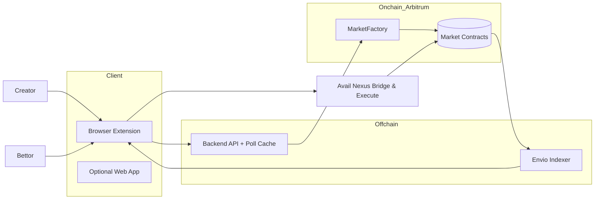
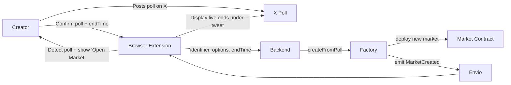
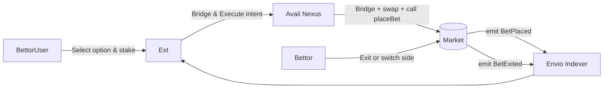
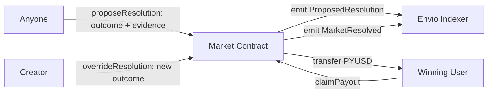

<div align="center">
  
</div>

<div align="center">

**POP – Predict on Posts** lets anyone turn any social media post into an onchain prediction market.


</div>

## Introduction

When you browse social media, the extension automatically detects whether a prediction market exists for the post you're viewing. If a market hasn't been created yet, it analyzes the post and offers anyone the opportunity to set one up. Once a market is live, users can participate by staking on outcomes they believe in.

Players can bet on their preferred outcomes, adjust their positions before the poll closes, or exit early - all while interacting directly on the platform.

---

## Pain Points We're Solving

Prediction markets today are broken:

- Platforms like Polymarket decide which markets get created - you can't just start one yourself
- You have to leave social media (where you get news about events) just to find and bet on markets
- Only viral questions get enough volume - niche topics die
- Creators can't monetize their own engagement

POP changes this. Anyone can create markets for any post. Betting happens right where the conversation does.

---

## Architecture

### Frontend

**Deployment**: [https://predict-on-posts.vercel.app/](https://predict-on-posts.vercel.app/)

- Next.js web dashboard for browsing markets and managing predictions
- Browser extension for in-post betting directly on social media

### Backend API

**Deployment**: [Link TBD]

- NestJS API that caches social media post metadata and orchestrates market creation
- Provides endpoints for post analysis and market data retrieval

### Smart Contracts

**Deployment**: [Arbitrum Sepolia](https://sepolia.arbiscan.io/address/0x84bBEB5383A2da8AcA2008B3505fCb338AE850c4)

- MarketFactory contract that deploys individual market instances on-chain
- Market contracts that handle betting, exiting, and resolution with PYUSD collateral

### Indexer (Envio)

**Deployment**: [GraphQL Endpoint TBD]

- Real-time blockchain event indexing for market activity
- Provides GraphQL API for querying market state, bets, and resolution history

---

## Market Lifecycle Overview



---

## 4. Poll Creation → Market Creation

When a creator posts a **poll** on Twitter, they can enable “Betting Mode” through the browser extension.

This creates a corresponding market onchain.



**Parameters set at creation**

- `identifier`: unique poll identifier (tweet ID today, extendable later)
- `pollOptions[]`: poll choices from X
- `creator`: wallet of poll creator
- `endTime`: poll close time
- `feeBps`: protocol + creator fee

---

## 5. Betting & Exiting

Users can stake PYUSD on any poll choice and exit before resolution — all inside the X UI.



### Mechanics

- Each option has its own **internal pool**.
- Implied odds = `pool_i / Σ(pool_j)` (informational only).
- Exiting returns proportional PYUSD based on current pool ratio.
- No ERC-20 outcome tokens are minted — balances tracked directly in contract mappings.

---

## 6. Resolution Flow (Open + Creator Override)

After the poll ends:

- Anyone can propose a result (e.g., “Option 1 won”).
- The **creator** has a short override window (e.g., 6 hours) to confirm or correct.
- If no override → proposed result finalizes automatically.



**Rules**

- `proposeResolution` allowed only after `endTime`.
- Creator override valid only during `CREATOR_WINDOW`.
- After that window, the proposed result becomes final.
- All PYUSD from losing sides goes to winners (minus fee).

---

## 7. Smart Contracts Overview

| Contract          | Responsibility                                              | Address (Arbitrum Sepolia)                   |
| ----------------- | ----------------------------------------------------------- | -------------------------------------------- |
| **MarketFactory** | Deploys markets for detected polls                          | `0x84bBEB5383A2da8AcA2008B3505fCb338AE850c4` |
| **Market**        | Stores stakes, allows exits, handles resolution and payouts | Deployed dynamically by MarketFactory        |

**Network Details:**

- **Network**: Arbitrum Sepolia (Chain ID: 421614)
- **Collateral Token**: Testnet USDC (`0x75faf114eafb1BDbe2F0316DF893fd58CE46AA4d`)
- **Creator Override Window**: 21,600 seconds (6 hours)
- **Block Explorer**: https://sepolia.arbiscan.io

**Market.sol key functions**

```solidity
function placeBet(uint8 option, uint256 amountPYUSD) external;
function exit(uint8 option, uint256 amountPYUSD) external;
function proposeResolution(uint8 option, string calldata evidenceURI) external;
function overrideResolution(uint8 option) external;
function claimPayout() external;
```

---

## 8. Events to Index (Envio)

| Event                                                  | Description              |
| ------------------------------------------------------ | ------------------------ |
| `MarketCreated(identifier, creator, options, endTime)` | Emitted on creation      |
| `BetPlaced(user, option, amount)`                      | User stakes PYUSD        |
| `BetExited(user, option, amount)`                      | User exits early         |
| `ProposedResolution(option, proposer)`                 | First resolution attempt |
| `MarketResolved(option, resolver)`                     | Final decision           |
| `PayoutClaimed(user, amount)`                          | Payouts completed        |

---

## 9. Components to Build

| Layer            | Service                | Description                                                  |
| ---------------- | ---------------------- | ------------------------------------------------------------ |
| **Client**       | Browser Extension      | Detects polls, injects betting UI, manages wallet connection |
|                  | Web Dashboard          | Lists active and past markets                                |
| **Offchain**     | Backend API            | Caches tweet/poll metadata, prepares Avail payloads          |
|                  | Envio Indexer          | Subscribes to contract events, provides GraphQL endpoint     |
| **Onchain**      | MarketFactory & Market | Core contracts on Arbitrum                                   |
| **Bridge Layer** | Avail Nexus SDK        | Bridges and executes PYUSD deposits from any chain           |

---

## 10. Future Extensions

- Automated proof-based resolution (TLS or Chainlink Functions)
- Reputation for accurate proposers
- Farcaster or Lens support
