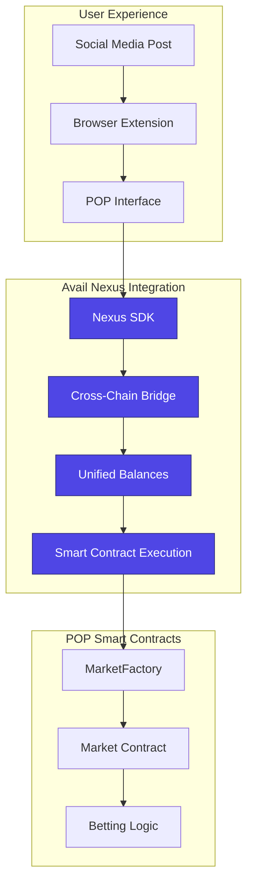

# POP: Predict on Posts - Avail Nexus Integration

<div align="center">
  
</div>

<div align="center">

**POP – Predict on Posts** leverages Avail Nexus to create the world's first cross-chain prediction market platform that works directly on social media.


</div>

## 🚀 Executive Summary

**POP** is a revolutionary prediction market platform that integrates **Avail Nexus** to enable seamless cross-chain betting directly on social media posts. Users can bridge tokens from any supported testnet chain and place bets without leaving their favorite social platforms.

### Why Avail Nexus is Critical to POP

Avail Nexus is the **core infrastructure** that makes POP possible:

1. **Cross-Chain Accessibility**: Users can bet from any supported testnet chain (Arbitrum Sepolia, Base Sepolia, Optimism Sepolia, Polygon Amoy, Sepolia)
2. **Seamless UX**: No need to manually switch chains or bridge tokens - Nexus handles everything
3. **Unified Balance Management**: Users see their portfolio across all chains in one interface
4. **Smart Optimizations**: Automatic routing and chain abstraction for optimal user experience

---

## 🏗️ Architecture Overview

### Core Integration Points



### Technology Stack

| Component | Technology | Avail Nexus Integration |
|-----------|------------|------------------------|
| **Frontend** | Next.js 15, React 19 | Nexus SDK + Widgets |
| **Cross-Chain** | Avail Nexus Core | `@avail-project/nexus-core` |
| **UI Components** | Avail Nexus Widgets | `@avail-project/nexus-widgets` |
| **Smart Contracts** | Solidity | Arbitrum Sepolia |
| **Indexer** | Envio | Real-time event tracking |

---

## 🔧 Avail Nexus Integration Details

### 1. SDK Integration

**Core Dependencies:**
```json
{
  "@avail-project/nexus-core": "^0.0.1",
  "@avail-project/nexus-widgets": "^0.0.6"
}
```

**Key Integration Files:**
- `frontend/hooks/utils/use-nexus-sdk.ts` - Core SDK wrapper
- `frontend/components/providers/nexus-provider.tsx` - React context provider
- `frontend/components/nexus/` - All Nexus-specific components

### 2. Cross-Chain Components

#### A. Unified Balance Display
```typescript
// frontend/components/nexus/unified-balance-display.tsx
export function UnifiedBalanceDisplay() {
  const { balances, usdcBalance, refreshBalances } = useNexusSDK();
  
  // Shows portfolio across all supported chains
  // Real-time balance updates
  // Chain breakdown visualization
}
```

#### B. Cross-Chain Bridge
```typescript
// frontend/components/nexus/cross-chain-bridge.tsx
export function CrossChainBridge() {
  const { bridge, simulateBridge, progress } = useNexusSDK();
  
  // Bridge tokens between any supported chains
  // Real-time progress tracking
  // Simulation before execution
}
```

#### C. Bridge and Execute Widgets
```typescript
// frontend/components/nexus/bridge-and-bet-button.tsx
<BridgeAndExecuteButton
  contractAddress={marketAddress}
  contractAbi={MARKET_ABI}
  functionName="placeBet"
  buildFunctionParams={(token, amount, chainId, user) => ({
    functionParams: [option, amountWei],
  })}
  prefill={{
    toChainId: 421614, // Arbitrum Sepolia
    token: 'USDC',
    amount: amount,
  }}
>
```

### 3. Supported Networks

| Network | Chain ID | Status | Use Case |
|---------|----------|--------|----------|
| **Arbitrum Sepolia** | 421614 | ✅ Primary | Main POP contracts |
| **Base Sepolia** | 84532 | ✅ Active | Cross-chain betting |
| **Optimism Sepolia** | 11155420 | ✅ Active | Cross-chain betting |
| **Polygon Amoy** | 80002 | ✅ Active | Cross-chain betting |
| **Sepolia** | 11155111 | ✅ Active | Cross-chain betting |

---

## 🎯 User Flow with Avail Nexus

### 1. Discovery Phase
```
User browses social media → Extension detects post → Shows "Create Market" option
```

### 2. Market Creation Flow
```
Creator clicks "Create Market" → Nexus bridges ETH → Deploys market contract → Market goes live
```

### 3. Betting Flow
```
User selects outcome → Checks USDC balance → 
├─ Has USDC: Direct bet placement
└─ No USDC: Nexus bridges ETH→USDC → Places bet
```

### 4. Cross-Chain Experience
```
User on Base Sepolia → Wants to bet on Arbitrum market → 
Nexus automatically bridges → Executes bet → Updates balances
```

---

## 🛠️ Key Avail Nexus Features Used

### 1. **Unified Balance Management**
- **File**: `frontend/components/nexus/unified-balance-display.tsx`
- **Functionality**: Real-time portfolio view across all chains
- **User Benefit**: See total value and chain-specific breakdowns

### 2. **Cross-Chain Bridging**
- **File**: `frontend/components/nexus/cross-chain-bridge.tsx`
- **Functionality**: Bridge tokens between any supported testnet
- **User Benefit**: Seamless asset movement without manual steps

### 3. **Bridge and Execute**
- **File**: `frontend/components/nexus/bridge-and-bet-button.tsx`
- **Functionality**: Bridge + smart contract execution in one transaction
- **User Benefit**: Single-click betting from any chain

### 4. **Progress Tracking**
- **File**: `frontend/hooks/utils/use-nexus-sdk.ts`
- **Functionality**: Real-time transaction progress with step-by-step updates
- **User Benefit**: Clear visibility into complex cross-chain operations

### 5. **Smart Optimizations**
- **File**: `frontend/components/nexus/nexus-showcase.tsx`
- **Functionality**: Automatic routing and chain abstraction
- **User Benefit**: Optimal gas usage and transaction routing

---

## 📊 Technical Implementation

### 1. SDK Initialization
```typescript
// frontend/hooks/utils/use-nexus-sdk.ts
const initialize = useCallback(async (provider: any) => {
  const sdk = new NexusSDK({ network: 'testnet' as NexusNetwork });
  await sdk.initialize(provider);
  
  // Set up event listeners for progress tracking
  setupEventListeners(sdk);
  
  // Fetch initial balances
  const balances = await sdk.getUnifiedBalances();
}, []);
```

### 2. Bridge and Execute Pattern
```typescript
// frontend/components/nexus/bridge-and-bet-button.tsx
<BridgeAndExecuteButton
  contractAddress={marketAddress}
  contractAbi={MARKET_ABI}
  functionName="placeBet"
  buildFunctionParams={(token, amount, chainId, user) => {
    const decimals = token === 'USDC' ? 6 : 18;
    const amountWei = parseUnits(amount, decimals);
    return { functionParams: [option, amountWei] };
  }}
  prefill={{
    toChainId: 421614, // Target chain
    token: 'USDC',     // Token to bridge
    amount: amount,    // Amount to bridge
  }}
>
```

### 3. Progress Tracking
```typescript
// Real-time progress updates
const unsubscribeBridgeExecuteExpected = sdk.nexusEvents.on(
  NEXUS_EVENTS.BRIDGE_EXECUTE_EXPECTED_STEPS,
  (steps: ProgressStep[]) => {
    setProgress({
      isActive: true,
      totalSteps: steps.length,
      steps,
      currentStep: 0,
    });
  }
);
```

---

## 🎨 User Experience Enhancements

### 1. **Seamless Onboarding**
- Users connect wallet once
- Nexus handles all chain management
- No manual network switching required

### 2. **Intelligent Balance Detection**
- Automatic USDC balance checking
- Smart suggestions for bridging when needed
- Real-time balance updates

### 3. **One-Click Operations**
- Bridge + Bet in single transaction
- Bridge + Create Market in single transaction
- No multi-step manual processes

### 4. **Visual Progress Tracking**
- Animated step-by-step progress
- Real-time status updates
- Clear success/error states

---

## 🔄 Integration Patterns

### 1. **Provider Pattern**
```typescript
// frontend/components/providers/nexus-provider.tsx
export function NexusProvider({ children }: { children: ReactNode }) {
  const nexusSDK = useNexusSDKHook();
  return (
    <NexusSDKContext.Provider value={nexusSDK}>
      {children}
    </NexusSDKContext.Provider>
  );
}
```

### 2. **Hook Pattern**
```typescript
// frontend/hooks/utils/use-nexus-sdk.ts
export function useNexusSDK() {
  const context = useContext(NexusSDKContext);
  if (!context) {
    throw new Error('useNexusSDK must be used within NexusProvider');
  }
  return context;
}
```

### 3. **Widget Pattern**
```typescript
// Direct widget integration for specific use cases
<BridgeAndExecuteButton
  contractAddress={marketAddress}
  contractAbi={MARKET_ABI}
  functionName="placeBet"
  // ... configuration
>
  {({ onClick, isLoading, disabled }) => (
    <Button onClick={onClick} disabled={isLoading || disabled}>
      Bridge & Bet
    </Button>
  )}
</BridgeAndExecuteButton>
```

---

## 🚀 Critical Value Propositions

### 1. **For Users**
- **No Chain Awareness Required**: Users don't need to know which chain they're on
- **Unified Experience**: Single interface for all cross-chain operations
- **Reduced Friction**: No manual bridging or chain switching
- **Better UX**: One-click operations instead of multi-step processes

### 2. **For Developers**
- **Simplified Integration**: Pre-built widgets for common patterns
- **Event-Driven Architecture**: Real-time progress tracking
- **Type Safety**: Full TypeScript support with generated types
- **Error Handling**: Comprehensive error boundaries and fallbacks

### 3. **For the Ecosystem**
- **Cross-Chain Adoption**: Enables users from any supported chain to participate
- **Liquidity Aggregation**: Unifies liquidity across multiple testnets
- **Innovation Catalyst**: Enables new cross-chain DeFi patterns

---

## 📈 Performance & Optimization

### 1. **Smart Routing**
- Automatic selection of optimal bridge routes
- Gas optimization across chains
- Fallback mechanisms for failed transactions

### 2. **Caching & State Management**
- Unified balance caching
- Real-time updates with minimal API calls
- Optimistic UI updates

### 3. **Error Handling**
- Comprehensive error boundaries
- User-friendly error messages
- Automatic retry mechanisms

---

## 🔮 Future Roadmap

### Phase 1: Current Implementation ✅
- [x] Basic cross-chain bridging
- [x] Unified balance management
- [x] Bridge and execute patterns
- [x] Progress tracking

### Phase 2: Enhanced Features 🚧
- [ ] Multi-token support (ETH, USDT, etc.)
- [ ] Advanced routing algorithms
- [ ] Gas optimization strategies
- [ ] Mobile wallet integration

### Phase 3: Advanced Integration 🔮
- [ ] Cross-chain market creation
- [ ] Multi-chain liquidity aggregation
- [ ] Advanced analytics and insights
- [ ] Custom bridge configurations

---

## 🎯 Conclusion

**POP** demonstrates the transformative power of **Avail Nexus** in creating seamless cross-chain experiences. By abstracting away the complexity of multi-chain operations, we've created a prediction market platform that works naturally across all supported testnets.

### Key Achievements:
1. **Zero-Friction Cross-Chain Betting**: Users can bet from any supported chain without manual bridging
2. **Unified Portfolio Management**: Single interface for all cross-chain assets
3. **Intelligent Automation**: Smart routing and optimization for optimal user experience
4. **Developer-Friendly Integration**: Clean APIs and comprehensive documentation

**Avail Nexus** is not just a tool for POP—it's the foundation that makes cross-chain DeFi accessible to mainstream users. This integration showcases the future of multi-chain applications where users don't need to think about chains, just outcomes.

---

## 📞 Contact & Support

- **Project Repository**: [GitHub Link]
- **Live Demo**: [https://predict-on-posts.vercel.app/](https://predict-on-posts.vercel.app/)
- **Documentation**: [Project README](./README.md)
- **Avail Nexus Docs**: [https://docs.envio.dev/docs/HyperIndex-LLM/hyperindex-complete](https://docs.envio.dev/docs/HyperIndex-LLM/hyperindex-complete)

---

*Built with ❤️ using Avail Nexus - The future of cross-chain DeFi*
